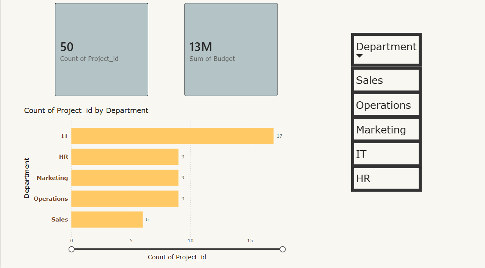
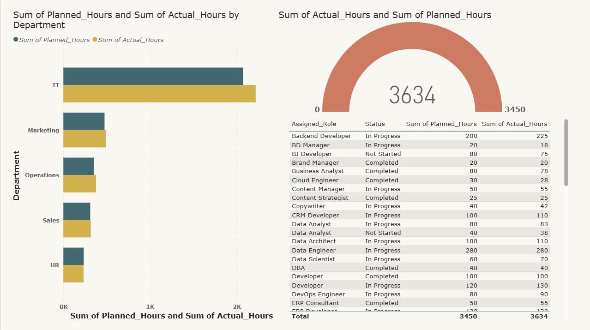
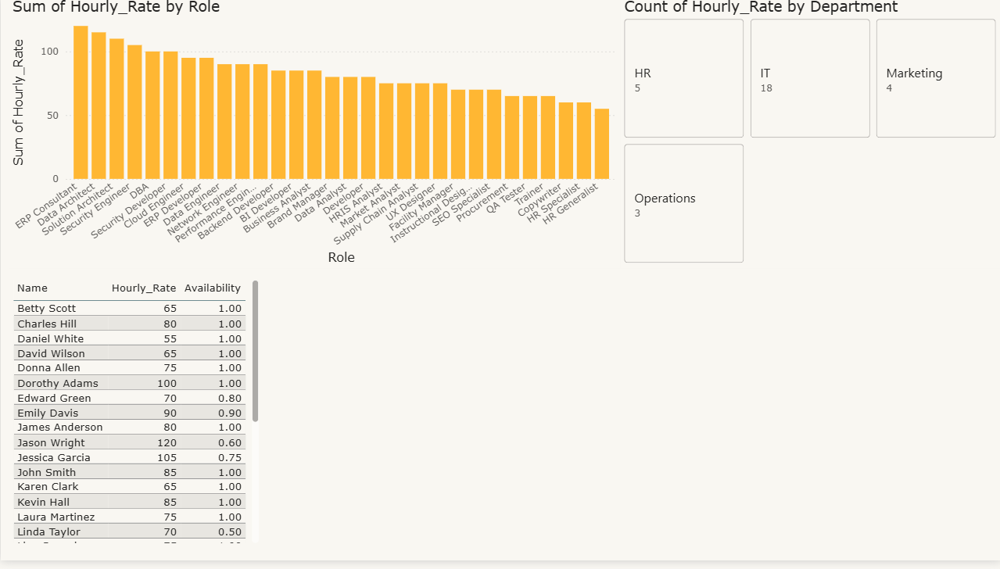
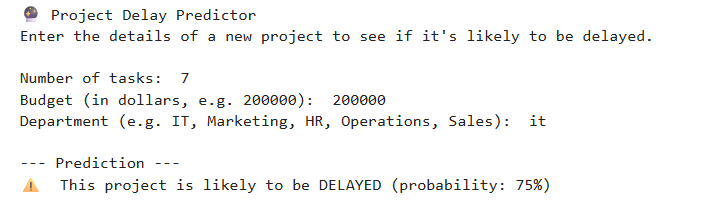

# Project Performance & Resource Analyzer

A complete data analysis project covering the full analytics pipeline: **Excel**, **SQL**, **Python**, and **Power BI**.  
Built to demonstrate how data can drive better project management decisions.

## 🎯 Objective
To analyze project and task data across departments and uncover insights about task efficiency, resource utilisation, and potential project delays. The project also includes a simple machine learning model that predicts whether a new project is likely to exceed its planned hours.

## 🛠️ Tools & Skills
- **Excel:** Data cleaning, pivot tables, VLOOKUP, formulas (SUMIF, COUNTIF).
- **SQL:** Database creation, JOINs (INNER, LEFT), grouping, handling missing data (NULL → 0).
- **Python:** Data manipulation with pandas, merges, aggregations, simple machine learning (Logistic Regression), interactive prediction tool.
- **Power BI:** Interactive dashboard with KPIs, bar charts, tables, and slicers.

## 📊 Key Insights
- **IT** had the most projects (18) and the largest total budget.
- **24 out of 50 projects** had no tasks recorded, revealing a data‑entry gap.
- **Over 30% of tasks** exceeded their planned hours, indicating frequent underestimation.
- The **average planned hours per task** varied significantly by department, with IT tasks requiring the most effort.
- A logistic regression model can predict project delay (overrun) with ~80% accuracy using just task count, budget, and department.

## 📁 Data Model
Three connected tables (star schema):
- **Projects** (50 rows) – project details, budget, dates, department.
- **Tasks** (75 rows) – task-level hours, status, assigned role.
- **Resources** (30 rows) – role‑based hourly rates and availability.

Relationships:  
`Projects.Project_ID` → `Tasks.Project_ID`  
`Resources.Role` → `Tasks.Assigned_Role`

## 📈 Workflow & Deliverables

### 1. Excel
- Initial data exploration, pivot tables, VLOOKUP to link tables.
- Formulas for counting projects per department, total budget, etc.

### 2. SQL (SQLite / DB Browser)
- Wrote queries to join tables, count tasks per project (including zeros with `LEFT JOIN`), and calculate cost using resource rates.
- File: `sql/queries.sql`

### 3. Python (Jupyter Notebook)
- Loaded CSV data, merged all three tables.
- Aggregated to project level and built a Logistic Regression model to predict delays.
- Created an interactive predictor where the user can input a new project's features and get an instant risk assessment.
- Visualised average planned hours by department.
- File: `python/analysis.ipynb`

### 4. Power BI Dashboard
- **Page 1 – Project Overview:** Cards (total projects, budget), bar chart (projects by department), project list table.
- **Page 2 – Tasks & Hours:** Clustered bar chart (planned vs actual hours), gauge (overall completion), task detail table.
- **Page 3 – Resources & Cost:** Bar chart (hourly rate by role), resource list table, department slicer.
- File: `powerbi/Project_Analysis.pbix`

## 📸 Dashboard Previews

### Project Overview

### Tasks & Hours

### Resources & Cost

### Python Analysis (Average Planned Hours by Department)

*(If you don't see the screenshots, please ensure the `images/` folder is populated with the PNG files.)*

## 🚀 How to Run This Project

1. **Excel:** Open `excel/projects_analysis.xlsx` to view raw data and pivot tables.
2. **SQL:** Run the queries in `sql/queries.sql` against the SQLite database (`project_data.db`).
3. **Python:** Open `python/analysis.ipynb` in Jupyter Notebook. Run all cells to generate the charts and the interactive predictor.
4. **Power BI:** Open `powerbi/Project_Analysis.pbix` in Power BI Desktop to interact with the dashboard.

## 🧠 What I Learned
- How to build a clean, multi‑table data model.
- Extracting insights using different tools for different stages (descriptive, diagnostic, predictive).
- Presenting results visually with Power BI.
- Managing a full data analysis project end‑to‑end and documenting it professionally.

## 👤 Author
[samikksha]  
GitHub: [samikksha3027](https://github.com/samikksha3027)

---

*This project was completed as part of my transition from Project Management to Data Analysis, showcasing my ability to combine domain knowledge with analytical skills.*
